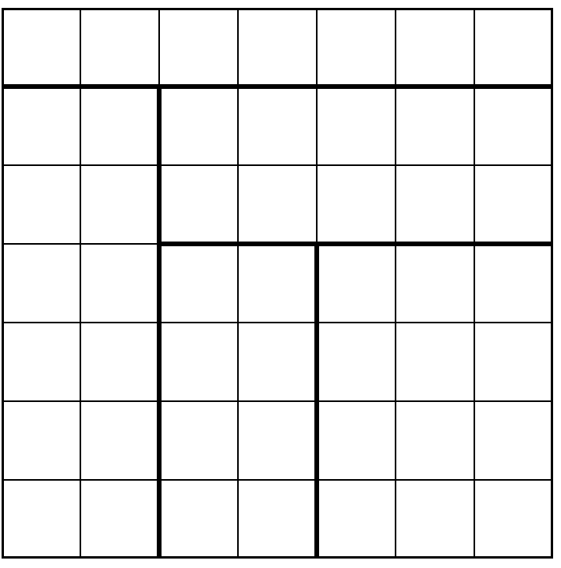
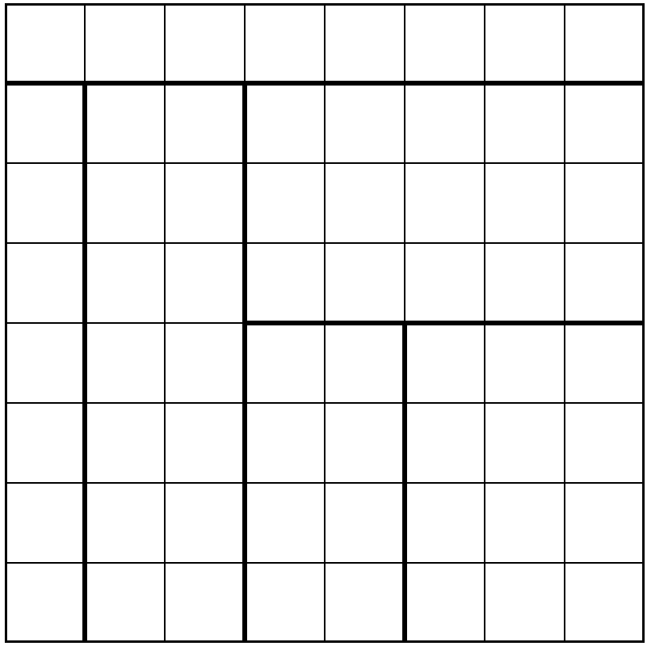
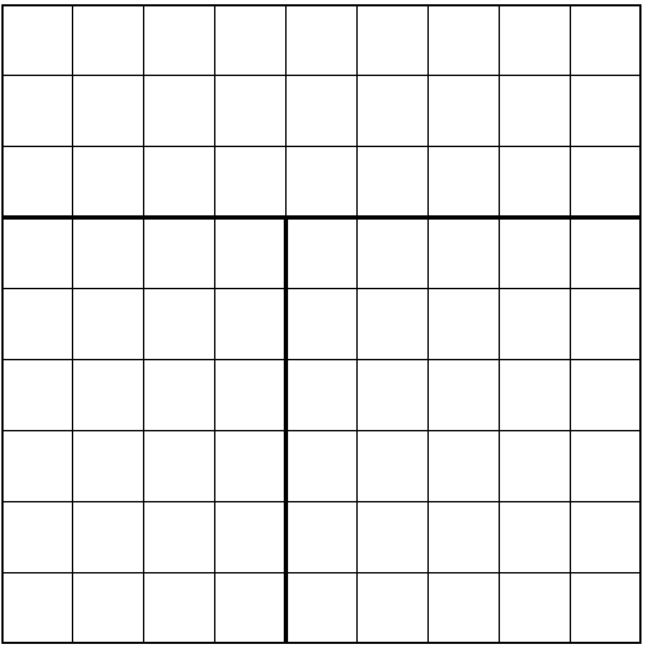
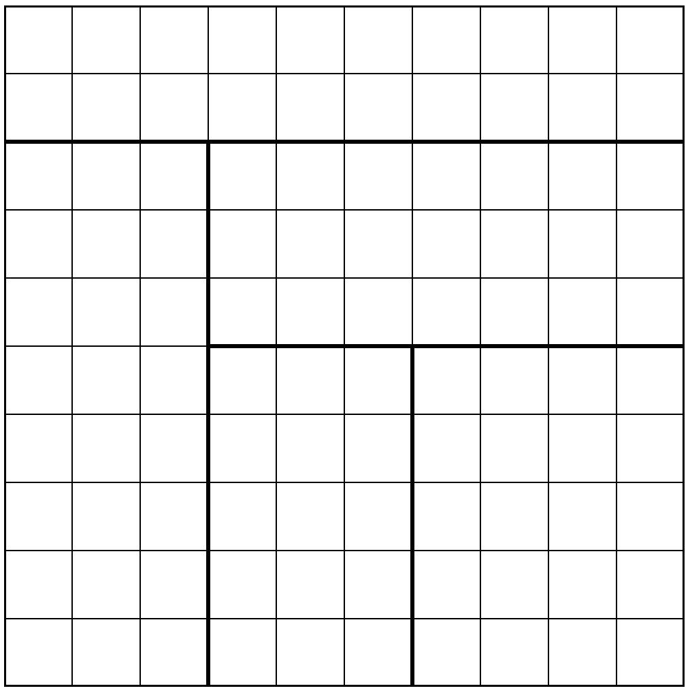
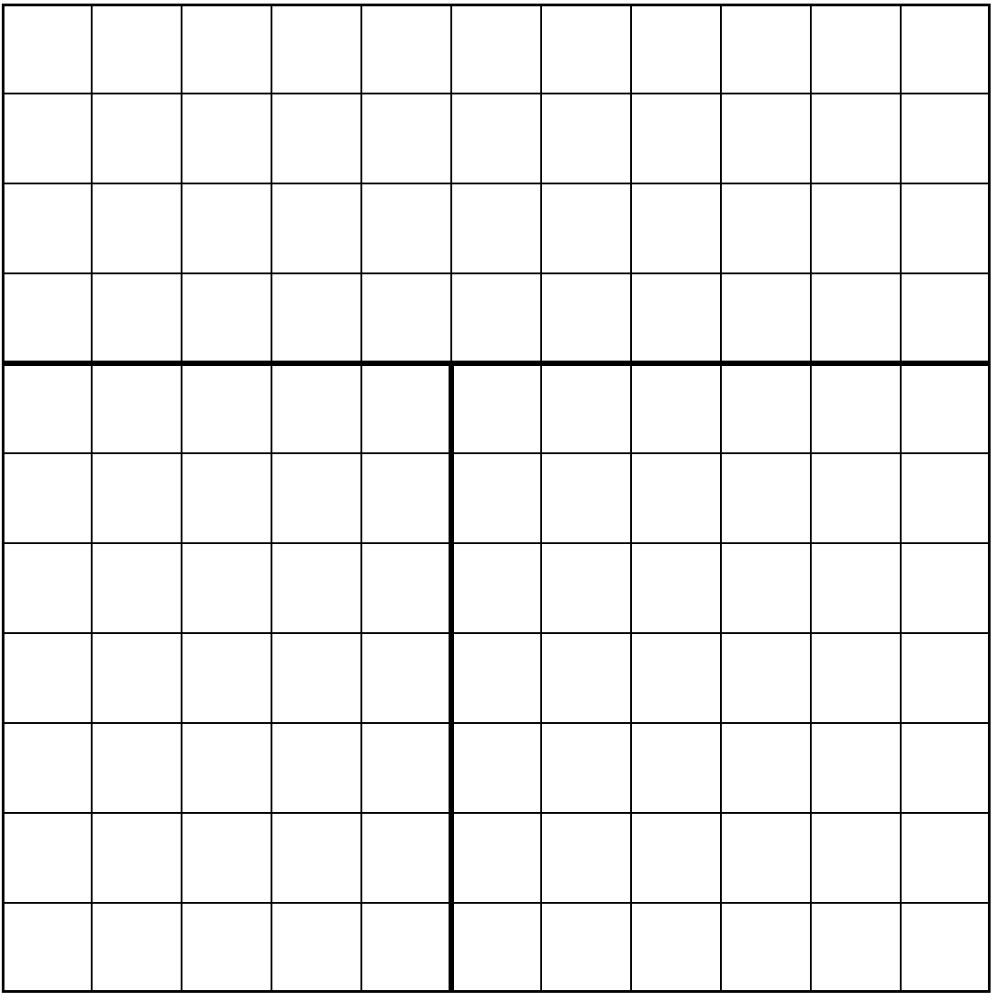
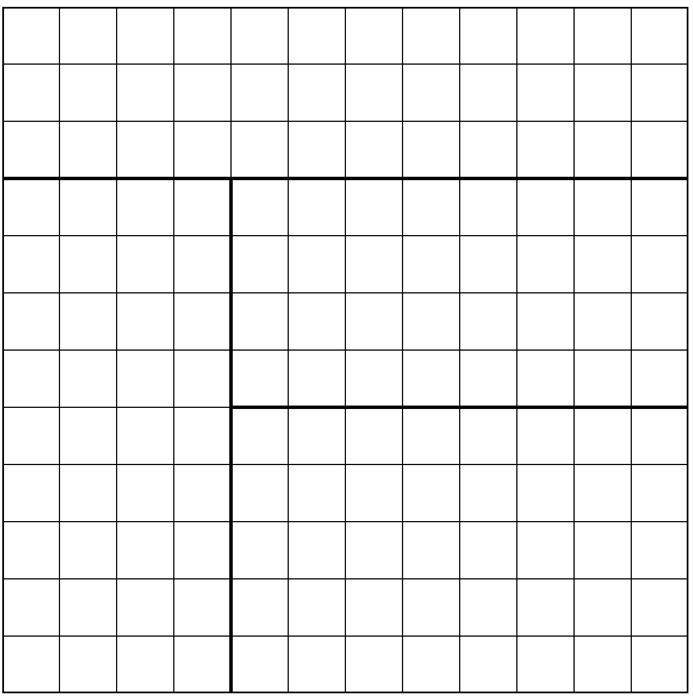

## Mondrian Solver

A Java implementation of stochastic beam search to solve the [Mondrian puzzle](https://mondrianpuzzle.appspot.com/index.html) (work in progress). In contrast to existing approaches of solving this employs a state-space search based approach.
In particular, we apply a stochastic beam search.   

To build the project install `maven` and execute
```
mvn compile
```

The algorithm implmented is a stochastic version of the best-first search with a bound on the number of states to visit.

To run the main class, simply execute the script with the following argument structure
```
run.sh <n> <max-depth> <max-size of state queue> <max-states-to-explore> <beam-size>
```
For example, a sample invocation is
```
run.sh 8 6 1000 1000 20 > nohup.out
```
where tile an 8x8 square with stochastic depth-first search (max depth to 6), with 1000 max number of states to store at any point of time (the program terminates once this limit is reached) and 1000 states to explore at max, and a beam-size of 20. 

The shell script also opens the browser with a rendering of the solution.

This script works on Mac with the Chrome browser. For a different browser/OS, please change the last line of `run.sh`. 

### Sample outputs

The following are the (optimal) solutions found by the algorithm. All the outputs have been generated by invoking the `run.sh` script,
e.g., the solution for n=7 was obtained with
```
./run.sh 7 6 40000 10000 30 > nohup.out
```

| n=7 | n=8 | n=9 |
|--|--|--|
|  |  | |
|score = 5 (optimal)| score = 6 (optimal) | score = 6 (optimal) |


| n=10 | n=11 | n=23 |
|--|--|--|
| |  |  |
|score = 9 (optimal = 8) | score = 9 (optimal = 6) | score = 8 (optimal = 7) |


